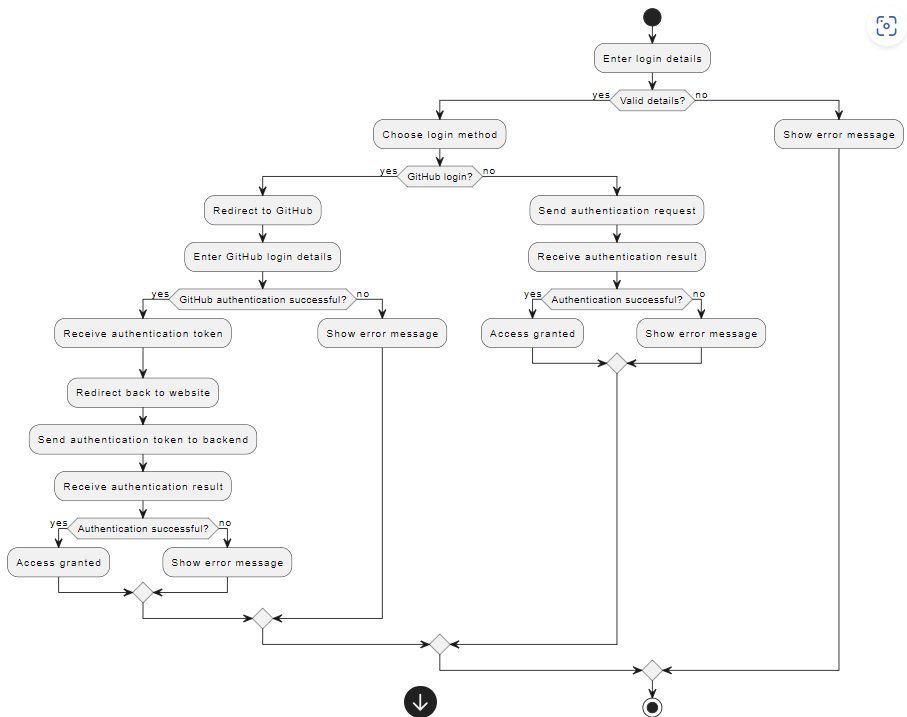
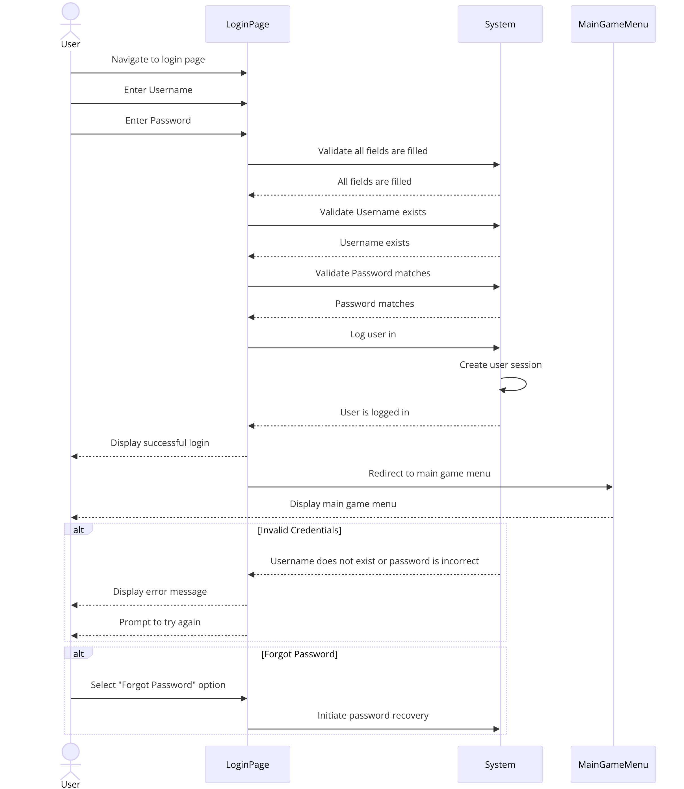
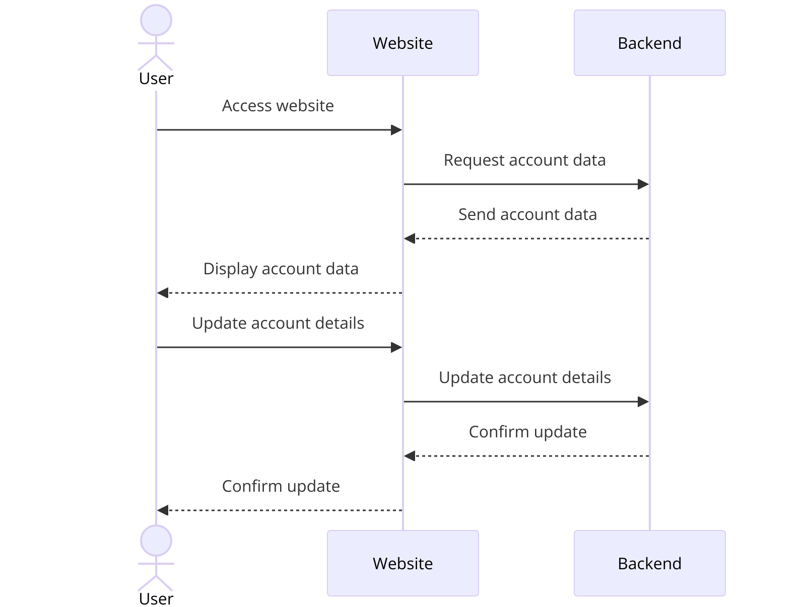

# srs2shine
## Software Requirements Specification
> This template is a simplified version based on the documentation templates from IBM Rational Unified Process (RUP).

### 1. Introduction
#### 1.1 Overview
A game hub where players can play and enjoy multiple different games of different styles directly in their browsers, whitout having to install any software.
#### 1.2 Scope
This Software Requirements Specification (SRS) document covers our whole project. It encompasses both functional and non-functional requirements necessary for the successful development, deployment, and operation of the platform. The document aims to provide a comprehensive understanding of the system's architecture, features, and limitations.
#### 1.3 Definitions, Acronyms and Abbreviations
- **API:** Application Programming Interface
- **Java:** The programming language we use in our backend
- **Pixi.JS:** OpenGL Renderer we use for building the games in our frontend
- **REST:** Representational State Transfer (a paradigm for API architecture)
- **Spring Boot:** Our backend framework (RESTful API)
- **tbd:** To be done
- **t2s:** Abbrevation for "time2shine"

#### 1.4 References
- [Handout](handout2shine_2nd_presentation.pdf)
- [Customer-Admin-Relationship](https://github.com/SE-TINF22B6/time2shine/assets/122756244/1d99b73e-5c79-4d2f-9660-1e3836c778d2)
- [UI-Template](https://github.com/SE-TINF22B6/time2shine/blob/main/Documentation/UITemplate.svg)
- [Highscore Activity Diagram](HighscoreActivityDiagram.png)
- [Login Sequence Diagram](Login_SequenceDiagram.png)
- [Account Management Activity Diagram](AccountManagement.png)
- [Accounts Activity Diagram](Accounts_Activity-diagram.png)
- [Quality Attribute Scenarios](https://github.com/SE-TINF22B6/time2shine/blob/main/Documentation/Quality_Attribute_Scenarios.md)

---

### 2. Functional requirements
This section will explain the different Use Cases we want to implement. It describes the individual pre- and post-conditions and gives a brief idea of what we want to accomplish.

#### 2.1 Overview 
Our website will function as a game hub. After you registered yourself, you can play various games on the website.

#### 2.2 Account Management
##### Highscore Activity Diagram

##### LogIn Sequence Diagram

##### Account Management Activity Diagram

- Relevant **account stories**: [Issue #20](https://github.com/SE-TINF22B6/time2shine/issues/20)
- **UI mockup:** Should look like the account view in the picture (see [our UI Mockup](https://github.com/SE-TINF22B6/time2shine/blob/main/Documentation/UITemplate.svg))
- **Activity diagram:** see [here](Accounts_Activity-diagram.png)
- **Preconditions:** We need a functioning backend that is able to hold account accounts.
- **Postconditions:** Users can now login. When they are logged in, some kind of token is stored in the account's browser session. This means he can now access his account page and play games...
- **Estimated effort:** high

#### 2.3 User Registration

Description
A user can create a new account by providing necessary details such as username, password, email, etc.

Actors
- User

Preconditions
- User is not logged in and is on the registration page.

Postconditions
- User account is created, and user is logged in.

Main Flow
- **User navigates to the registration page**: 
  - The user selects the "Sign Up" option from the homepage or login page.
- **User enters registration details**:
  - Username
  - Password (with confirmation)
  - Email
  - Optional fields (e.g., first name, last name)
- **System validates input**: The system checks that:
  - All required fields are filled.
  - Password and confirmation match.
  - Username and email are unique.
  - Email format is valid.
  - Password meets security requirements (e.g., minimum length, contains special characters).
- **System creates account**: Upon successful validation, the system:
  - Creates a new user account.
  - Stores the user information securely (e.g., hashed password).
  - Optionally sends a confirmation email to the user.
- **System logs user in**: The system logs the user in automatically.
- **System redirects user**: The user is redirected to the main game menu or a welcome page.

Alternate Flows
- **Invalid Input**: If any validation fails (e.g., username taken, invalid email), the system displays appropriate error messages and prompts the user to correct the input.
- **Optional Email Confirmation**: If email confirmation is required, the system sends a confirmation email with a link. The user must click the link to activate the account.

#### 2.4 User Login

Description
A user can log in to their account using their username and password.

Actors
- User

Preconditions
- User has an existing account and is on the login page.

Postconditions
- User is logged in and redirected to the main game menu.

Main Flow
- **User navigates to the login page**: 
  - The user selects the "Login" option from the homepage.
- **User enters login credentials**:
  - Username
  - Password
- **System validates credentials**: The system checks that:
  - Both fields are filled.
  - The username exists.
  - The password matches the stored password for the username.
- **System logs user in**: Upon successful validation, the system creates a session for the user.
- **System redirects user**: The user is redirected to the main game menu.

Alternate Flows
- **Invalid Credentials**: If the username does not exist or the password is incorrect, the system displays an error message and prompts the user to try again.
- **Forgot Password**: If the user cannot remember their password, they can select the "Forgot Password" option to initiate the password recovery process.

#### 2.5 Playing Games
- Relevant **account stories**: [Issue #18](https://github.com/SE-TINF22B6/time2shine/issues/18) and [Issue #19](https://github.com/SE-TINF22B6/time2shine/issues/19)
- **UI mockup:** Should look like the account view in the picture (see [our UI Mockup](https://github.com/SE-TINF22B6/time2shine/blob/main/Documentation/UITemplate.svg))
- **Preconditions:** The account system has to be implemented and working.
- **Postconditions:** Users can now login and play games.
- **Estimated effort:** high

#### 2.6 Start New Game of Snake

Description
A user can start a new game of Snake.

Actors
- User

Preconditions
- User is logged in.

Postconditions
- A new game of Snake begins.

Main Flow
- **User navigates to Snake game page**: 
  - The user selects the "Snake" option from the main menu.
- **User starts new game**: 
  - The user selects the "Start New Game" button.
- **System initializes game**: 
  - The system sets the initial position of the snake and places the first food item on the grid.
- **System starts game**: 
  - The game begins, and the snake starts moving.

Alternate Flows
- **Error in Game Initialization**: 
  - If there is an error in initializing the game, the system displays an error message and prompts the user to try again.
 
#### 2.7 Start New Game of Cookie Clicker

Description
A user can start a new game of Cookie Clicker.

Actors
- User

Preconditions
- User is logged in.

Postconditions
- A new game of Cookie Clicker begins.

Main Flow
- **User navigates to Cookie Clicker game page**: 
  - The user selects the "Cookie Clicker" option from the main menu.
- **User starts new game**: 
  - The user selects the "Start New Game" button.
- **System initializes game**: 
  - The system resets the game state, setting the initial cookie count to zero.
- **System starts game**: 
  - The game begins, and the user can start clicking the cookie.

Alternate Flows
- **Error in Game Initialization**: 
  - If there is an error in initializing the game, the system displays an error message and prompts the user to try again.

#### 2.8 Highscore Tracking
- Relevant **account stories**: [Issue #17](https://github.com/SE-TINF22B6/time2shine/issues/17)
- **UI mockup:** Should look like the account view in the picture (see [our UI Mockup](https://github.com/SE-TINF22B6/time2shine/blob/main/Documentation/UITemplate.svg))
- **Preconditions:** The account account system needs to be setup. Also, players have to be able to play games, and the results have to be stored.
- **Postconditions:** Based on the stored game results, the leaderboards are now being calculated and published on the website.
- **Estimated effort:** low

#### 2.9 View Game Statistics

Description
A user can view their game statistics for all games played.

Actors
- User

Preconditions
- User is logged in.

Postconditions
- Game statistics are displayed.

Main Flow
- **User navigates to the statistics page**: 
  - The user selects the "Statistics" option from the main menu.
- **System retrieves statistics**: 
  - The system fetches the user's game statistics from the database.
- **System displays statistics**: 
  - The system shows statistics such as high scores, number of games played, and total playtime for each game.
 
---

### 3. Nonfunctional requirements
This section shows the nonfunctional requirements which we want to provide. This includes functionalities to let the account feel as comfortable as possible while having all of his data secured.

#### 3.1 [Quality Attribute Scenarios](https://github.com/SE-TINF22B6/time2shine/blob/main/Documentation/Quality_Attribute_Scenarios.md)

#### 3.2 Maintainability and Modifiability
Since we plan on separating our project into dedicated frontend and backend, we dont't end up with a giant, unmaintainable monolithic construct, but rather a Services-based architecture. This means that the two parts are independant from each other and can e. g. be replaced if a used framework etc. is discontinued. Also, this approach makes us flexible in terms of scaling. In theory,we should be able to easily power on multiple instances of our backend for example.

#### 3.3 Performance
Players want the game platform to work fast and responsive, everything else would be a bad experience. Therefore, our whole system (Application, Backend, Database) has to be designed in a performant yet secure way to make sure to meet the users requirements.

#### 3.4 Availability
Our application should be always reachable so that users can play whenever they like.

#### 3.5 Security
We plan on using OAuth2 to secure our application, meaning that we use a current up-to-date technology that is used by most serious companies from all over the world. It makes communication between the different parts of our application secure. Also, scanning for cheaters is an important thing for keeping the account experience good.

#### 3.6 Testability
The code we write has to be testable in order to meet our quality requirements. 

---

### 4. Technical constraints
- **Backend:** A RESTful API build with Spring Boot in Kotlin
- **Database:** PostgreSQL Database
- **Frontend:** Based on the Pixi.JS OpenGL Renderer that we will use to build our games
- **Deployment:** As students, we can each get a 200 $ credit at Digital Ocean, a web hosting provider. We will spend them on running a Debian 12 instance there. We chose Digital Ocean over bwCloud due to the way better performance (we can choose from different server configurations there). We chose a VPS with 2 AMD EPYC cores and 4 GB of memory which will be sufficient for our use, but still a lot more performant than the offered bwCloud instance. On this server, we will run our Backend, the database and our frontend, each of them being a dedicated Docker Container.
